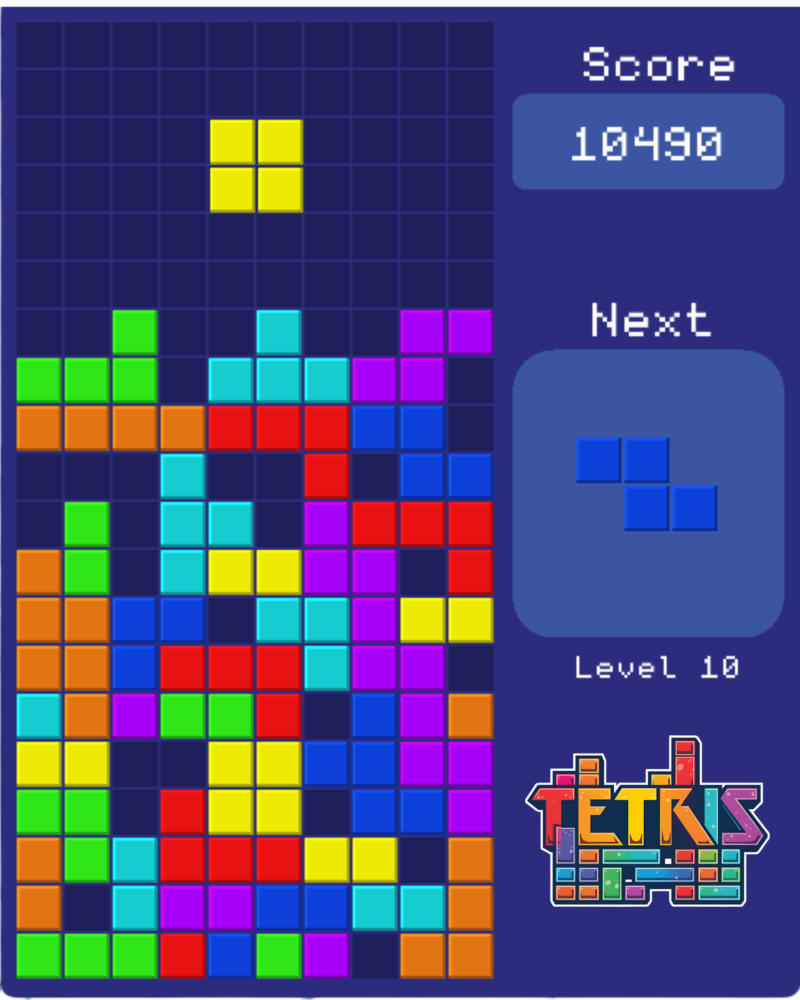

# 🎮 Retro Tetris

<p align="center">
  
</p>

A modern implementation of the classic **Tetris** game built with **C++** and [Raylib](https://www.raylib.com/).

[](https://www.raylib.com/)
[](https://isocpp.org/)

**Created by:** @Menmen770

---

## ✨ Features

- 🎯 **Classic Tetris gameplay** with authentic mechanics
- 🎚️ **12 difficulty levels** with increasing speed
- 🏆 **High Scores System**
  - Top 10 leaderboard saved to file
  - Name entry for new high scores
  - Persistent storage across sessions
- 🎨 **Retro-style graphics** with custom color schemes
- 🎵 **Sound effects** for line clears and game over
- ⌨️ **Smooth controls** with hard drop support
- 📊 **Real-time score and level display**

---

## 🎮 How to Play

### Controls

| Key        | Action                       |
| ---------- | ---------------------------- |
| **←/→**    | Move block left/right        |
| **↓**      | Soft drop (move down faster) |
| **↑**      | Rotate block                 |
| **SPACE**  | Hard drop (instant drop)     |
| **CTRL/H** | View high scores (from menu) |

### Gameplay

1. **Select Level**: Use ↑/↓ to choose starting level (1-12)
2. **Press SPACE**: Start the game
3. **Clear Lines**: Complete horizontal lines to score points
4. **Level Up**: Clear 10 lines to advance to the next level
5. **Beat High Scores**: Enter your name if you make the top 10!

### Scoring

- **1 Line**: 40 × Level
- **2 Lines**: 100 × Level
- **3 Lines**: 300 × Level
- **4 Lines (Tetris!)**: 1200 × Level

---

## 🚀 Installation & Building

### Prerequisites

- **C++ Compiler**: GCC, MinGW, Clang, or MSVC
- **Raylib 5.0+**: [Download here](https://www.raylib.com/)
- **Make**: For building with Makefile

### Clone Repository

```bash
git clone https://github.com/Menmen770/Retro-Tetris-Raylib-Game.git
cd Retro-Tetris-Raylib-Game/Raylib-CPP-Starter-Template-for-VSCODE-V2-main
```

### Build Instructions

#### Windows (MinGW)

```
mingw32-make RAYLIB_PATH=C:/raylib/raylib PROJECT_NAME=main "OBJS=src/main.cpp src/Game.cpp src/Block.cpp src/Grid.cpp src/Position.cpp src/Colors.cpp src/ScoreManager.cpp"
```

### Run the Game

main.exe

## 📁 Project Structure

```

src/
├── main.cpp # Entry point & game loop
├── Game.h/cpp # Main game logic
├── Block.h/cpp # Tetromino blocks
├── Blocks.cpp # All 7 block types (I, J, L, O, S, T, Z)
├── Grid.h/cpp # Game board/grid
├── Position.h/cpp # Position utilities
├── Colors.h/cpp # Color definitions
└── ScoreManager.h/cpp # High scores system

Font/
└── monogram.ttf # Retro-style font

Sounds/
├── clear.mp3 # Line clear sound
└── gameOver.mp3 # Game over sound

resources/
├── logo.png # Game logo
└── ico_logo.ico # Window icon

highscores.txt # Saved high scores

```

---

## 🎯 Game States

The game flows through multiple states:

1. **LEVEL_SELECT** - Choose starting difficulty
2. **PLAYING** - Active gameplay
3. **GAME_OVER** - Shows final score
4. **ENTER_NAME** - Input name for high score
5. **HIGH_SCORES** - Display top 10 leaderboard

---

## 🛠️ Technical Details

- **Language**: C++14
- **Graphics Library**: Raylib 5.0
- **Grid Size**: 20 rows × 10 columns
- **Cell Size**: 33 pixels (scaled 10% from classic 30px)
- **Window Size**: 550×682 pixels
- **Speed Table**: 12 progressive difficulty levels (0.8s to 0.15s)

---

## 🎨 Customization

### Modify Colors

Edit `src/Colors.cpp` to change block and UI colors.

### Adjust Difficulty

Modify the `speedTable[]` in `src/main.cpp` to change level speeds.

### Change Window Size

Update `InitWindow()` parameters in `src/main.cpp` and adjust cell size in `Block.cpp` and `Grid.cpp`.

---

## 📝 License

This project is open source. Feel free to use, modify, and distribute.

---

## 🙏 Credits

- **Developer**: @Menmen770
- **Library**: [Raylib](https://www.raylib.com/) by Ramon Santamaria
- **Font**: Monogram by Vinícius Menézio
- **Inspiration**: Classic Tetris by Alexey Pajitnov

---

## 📸 Screenshots

### Main Menu


### Gameplay


### High Scores


---

## 🐛 Known Issues / Future Improvements

- [ ] Add pause functionality
- [ ] Add background music
- [ ] Add visual effects for line clears
- [ ] Add ghost piece (preview landing position)
- [ ] Add next 3 pieces preview
- [ ] Save statistics (total lines, games played, etc.)

---

## 📞 Contact

Questions or suggestions? Open an issue on GitHub or contact @Menmen770.

---

**Enjoy the game! 🎮**

A modern re-implementation of the legendary classic **Tetris**, built from scratch in **C++** using the simple and powerful [Raylib](https://www.raylib.com/) game development library.

Includes:

- Multiple **difficulty levels**
- A **Top-10 High Scores** system (saved to file)
- Clean retro-style visuals

**By:** @Menmen770

---

## 🎬 Gameplay Overview

Fast-paced falling blocks (Tetrominoes) that you must rotate and position to complete full lines.
Each cleared line gives you points, and higher levels increase the block speed.

> 💡 Tip: You can add a GIF or screenshot of your game here later:
>
> ```markdown
> 
> ```

---

## 🌟 Features (מאפיינים)

- ✅ Classic **Tetris mechanics** – falling Tetrominoes, line clears, increasing difficulty
- ✅ **Level selection** screen before starting the game (בחר רמת קושי לפני תחילת המשחק)
- ✅ **Top 10 High Scores**:
  - Scores are saved to a `highscores.txt` file
  - A dedicated screen shows the best scores in a clean layout
- ✅ Simple and readable **C++ + Raylib** code structure
- ✅ Pause / Game Over screen

---

- **Library:** [Raylib 4.5+](https://www.raylib.com/) properly installed and linked

### 📥 Clone the Repository

```bash
git clone https://github.com/Menmen770/Retro-Tetris-Raylib-Game.git
cd Retro-Tetris-Raylib-Game
```
